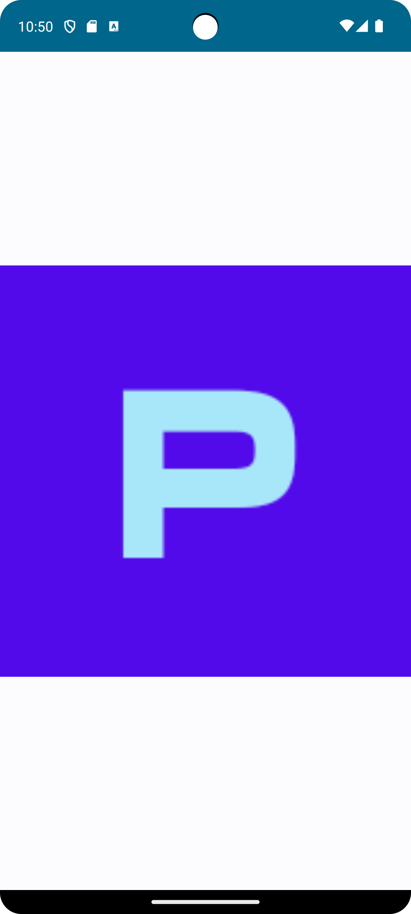
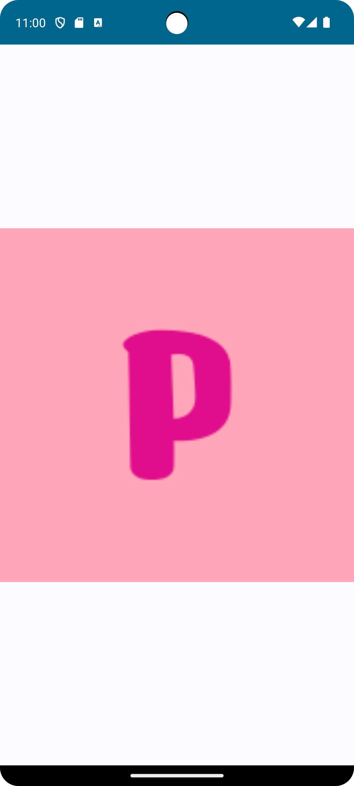

# Letter Avatar Generator

A **Kotlin Multiplatform** library that helps in creating letter avatars as bitmap images to use as profile placeholders. Supports **Android** and **iOS** platforms with native **Compose Multiplatform** integration.

Includes customization options like setting colors for background and letter. You can also set custom color pairs to choose randomly.




## Supported Platforms

- **Android** - Uses native `Bitmap` and `Canvas`
- **iOS** (iosX64, iosArm64, iosSimulatorArm64) - Uses native `CGImage` and `CoreGraphics`

## Installation

### Gradle (Kotlin DSL)

Add the dependency to your module's `build.gradle.kts`:

```kotlin
repositories {
    mavenCentral()
    google()
    maven { url = uri("https://jitpack.io") }
}

dependencies {
    implementation("com.github.Pranathi-pellakuru:LetterAvatarGenerator:v1.1")
}
```

## Usage in Compose Multiplatform

The library provides native Compose integration, making it easy to use in shared code without platform-specific boilerplate.

```kotlin
import com.pranathicodes.letteravatar.rememberAvatarCreator
import com.pranathicodes.letteravatar.asImageBitmap

@Composable
fun MyAvatar() {
    // 1. Get the platform-specific creator
    val avatarCreator = rememberAvatarCreator()
    
    // 2. Build the avatar and convert to ImageBitmap
    val avatarBitmap = remember(avatarCreator) {
        avatarCreator
            .setLetter('P')
            .setAvatarSize(300)
            .setLetterColor(0xFFFFFFFF.toInt()) // White
            .setBackgroundColor(0xFFFF5722.toInt()) // Orange
            .build()
            .asImageBitmap()
    }

    // 3. Display using standard Compose Image
    Image(
        bitmap = avatarBitmap,
        contentDescription = "User Avatar"
    )
}
```

## Customization

### Colors

**Using predefined color constants:**
`Colors.WHITE`, `Colors.BLACK`, `Colors.GRAY`, `Colors.CYAN`, `Colors.MAGENTA`, `Colors.RED`, `Colors.GREEN`, `Colors.BLUE`, `Colors.YELLOW`

### Random Colors

The library includes a `RandomColors` helper to pick colors or pairs:

```kotlin
val randomColors = RandomColors()
// Pick a random color pair
val colorPair = randomColors.getColorPair()

avatarCreator
    .setLetterColor(colorPair.first)
    .setBackgroundColor(colorPair.second)
```

## API Reference

### AvatarCreator

| Method | Description |
|--------|-------------|
| `setLetter(letter: Char)` | Sets the letter to display |
| `setTextSize(size: Int)` | Sets text size in pixels (default: 25) |
| `setAvatarSize(size: Int)` | Sets output image size in pixels (default: 180) |
| `setLetterColor(color: Int)` | Sets letter color (ARGB format) |
| `setBackgroundColor(color: Int)` | Sets background color (ARGB format) |
| `setFont(font: PlatformTypeface)`| Sets a custom font |
| `build()` | Returns `PlatformBitmap` |

### Compose Extensions

- `rememberAvatarCreator()`: Composable function to get the creator.
- `PlatformBitmap.asImageBitmap()`: Extension to convert native bitmap to Compose `ImageBitmap`.

## License

This project is licensed under the MIT License.
